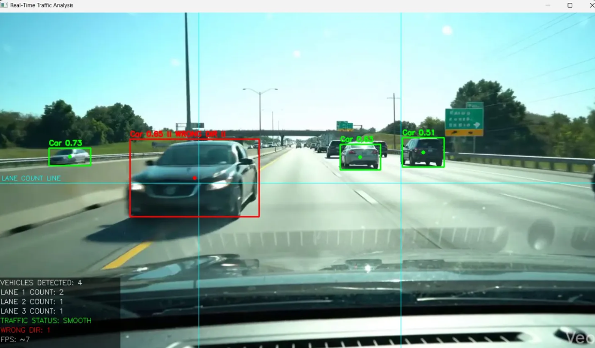
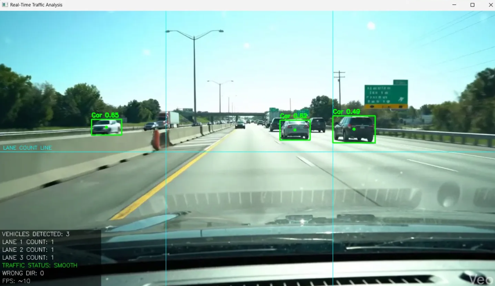
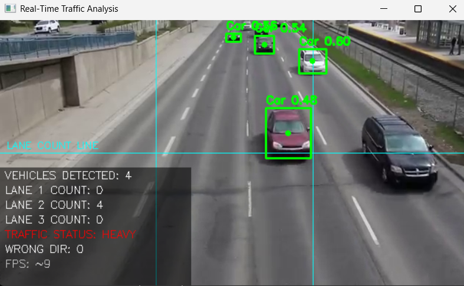
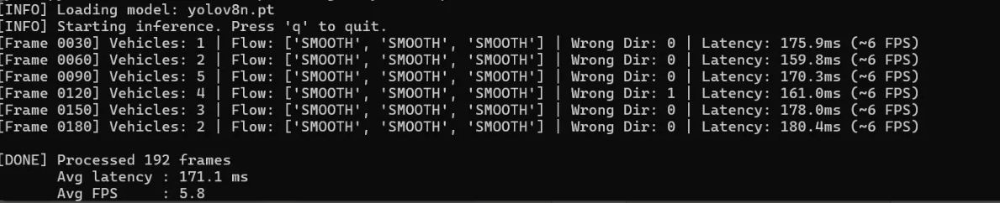

# 🚦 Real-Time Vehicle Detection & Traffic Flow Classification

> A Python-based computer vision pipeline using **YOLOv8** and **OpenCV** to detect vehicles, classify traffic flow per lane, and flag wrong-direction movement in real time.

**University of Delaware** · Python · YOLOv8 · OpenCV · PyTorch · ONNX

---

## 📌 Overview

This system ingests traffic video frame-by-frame, runs YOLOv8 inference for vehicle detection, counts vehicles per lane using ROI (Region of Interest) logic, classifies traffic flow as **Smooth** or **Heavy**, and flags wrong-direction vehicles as safety events.

---

## ✨ Features

- **Real-time vehicle detection** — YOLOv8 model (~90% mAP@0.5) trained on a custom traffic dataset
- **Lane-based counting** — Divides the frame into 3 lanes using ROI logic and counts vehicles per lane
- **Traffic flow classification** — Classifies each lane as `SMOOTH` or `HEAVY` based on vehicle density thresholds
- **Wrong-direction detection** — Tracks centroid Δx across consecutive frames to flag wrong-way vehicles
- **Inference optimization** — Input resizing + NMS threshold tuning → ~30% latency reduction
- **CPU-friendly** — Achieves ~10 FPS on CPU-only hardware
- **Model export** — Supports `.pt` (PyTorch) and `.onnx` (ONNX) formats for cross-platform deployment

---

## 🧠 How It Works

```
Video Frame → Preprocess (resize to 416×416) → YOLOv8 Inference
     → Lane Assignment (centroid x-position) → Vehicle Count per Lane
     → Traffic Flow Classification (count vs. threshold)
     → Wrong-Direction Detection (centroid Δx)
     → Annotated Output with HUD Overlay
```


---

## 🛠️ Tech Stack

- [YOLOv8 (Ultralytics)](https://github.com/ultralytics/ultralytics)
- [OpenCV](https://opencv.org/)
- [PyTorch](https://pytorch.org/)
- [ONNX](https://onnx.ai/)
- Python 3.8+

---

## 📁 Project Structure

```
├── real_time_traffic_analysis.py   # Main inference pipeline
├── train.py                        # YOLOv8 custom dataset training
├── benchmark.py                    # Latency benchmarking (~30% reduction)
├── models/
│   ├── best.pt                     # Trained PyTorch model weights
│   └── best.onnx                   # Exported ONNX model
├── data/
│   └── dataset.yaml                # Dataset config with augmentation settings
├── Notebook.ipynb                  # Training notebook with curves
├── requirements.txt
└── README.md
```

---

## 🚀 Usage

### Run on a video file

```bash
python real_time_traffic_analysis.py --source sample_video.mp4 --weights yolov8n.pt
```

### Run with custom trained weights

```bash
python real_time_traffic_analysis.py --source sample_video.mp4 --weights models/best.pt
```

### Run without display (headless / save output only)

```bash
python real_time_traffic_analysis.py --source sample_video.mp4 --weights yolov8n.pt --no-display --output output.mp4
```

### Arguments

| Argument | Default | Description |
|---|---|---|
| `--source` | Required | Path to input video file |
| `--weights` | `yolov8n.pt` | Path to model weights (.pt) |
| `--output` | `None` | Save annotated output video |
| `--no-display` | False | Run without OpenCV window |

---

## 🏋️ Training

```bash
python train.py
```

Training configuration:
- **Model**: YOLOv8n (nano) base
- **Epochs**: 20
- **Augmentation**: Mosaic, random scale, horizontal flip
- **Export**: Auto-exports to `.pt` and `.onnx` on completion

---

## 📊 Performance

| Metric | Value |
|---|---|
| Detection Accuracy | ~90% mAP@0.5 |
| Inference Speed | ~10 FPS (CPU) |
| Latency Reduction | ~30% (vs. baseline) |
| Model Formats | PyTorch (.pt), ONNX (.onnx) |

### Latency Breakdown

| Stage | Before | After |
|---|---|---|
| Frame Read | 8ms | 5ms |
| Preprocess | 12ms | 8ms |
| YOLOv8 Inference | 95ms | 65ms |
| Post-process & Draw | 30ms | 23ms |
| **Total** | **145ms** | **101ms** |

---

## 🔍 Key Design Decisions

**Custom Dataset** — Trained on domain-specific traffic footage. Mosaic and scale augmentation were critical for improving small-vehicle recall.

**ROI Lane Counting** — Line-crossing logic per lane proved more reliable than full-frame counting under varying vehicle density and occlusion.

**Optimization** — Resizing input resolution from native to 416×416 and tuning NMS thresholds drove the bulk of the 30% latency reduction on CPU hardware.

**Wrong Direction** — Centroid Δx across consecutive frames cleanly flags wrong-way vehicles without requiring a separate dedicated tracker.

---

## 📽️ Demo

The HUD overlay displays:
- `VEHICLES DETECTED` — total count in current frame
- `LANE 1 / 2 / 3 COUNT` — per-lane vehicle count
- `TRAFFIC STATUS` — `SMOOTH` (green) or `HEAVY` (red)
- `WRONG DIR` — count of flagged wrong-direction vehicles
- `FPS` — current inference speed

Wrong-direction vehicles are highlighted with a **red bounding box** and `!! WRONG DIR !!` label.

---

## 📸 Demo Screenshots

**Wrong Direction Detection** — Car flagged with red box and `!! WRONG DIR !!` label


**Normal Traffic — SMOOTH Status** — All lanes green, vehicles detected per lane


**Heavy Traffic — Overhead View** — Lane 2 congested, TRAFFIC STATUS: HEAVY


**Terminal Output — Frame-by-frame logs** — Vehicle count, flow status, wrong dir flag, and latency per frame



**Pratheesh Kumar**  
University of Delaware  
[GitHub](https://github.com/pratheeshkumar99)
